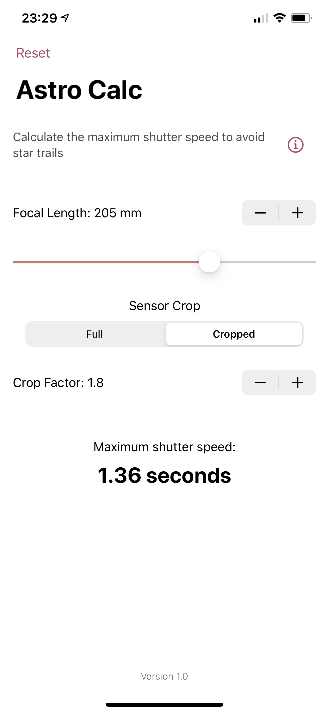
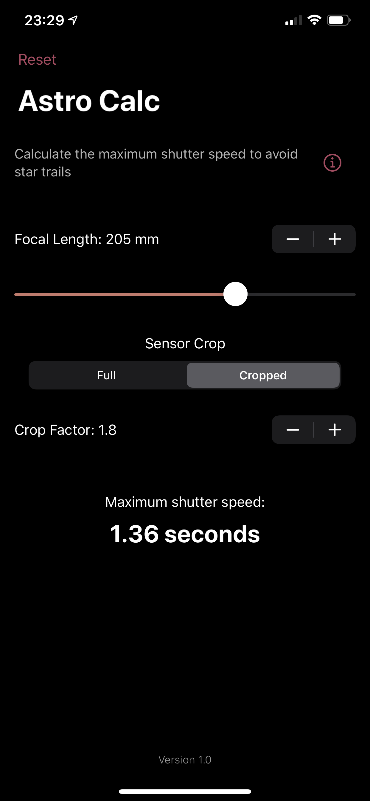

# Astro Calc
## Calculate max shutter speed to remove star trails from astrophotography shots

<strong><em>Written in SwiftUI. Runs on iOS, iPadOS and macOS (Catalyst)</em></strong>

### Background
When taking pictures of the night sky, a maximum shutter speed exists, influenced by focal length and sensor crop factor.

To calculate this we use the **500 Rule**.

    Max shutter speed = 500 / (crop * focal length)

### Screenshots

Light mode ☀️ | Dark mode 🌙
:-------------------------:|:-------------------------:
 | 
